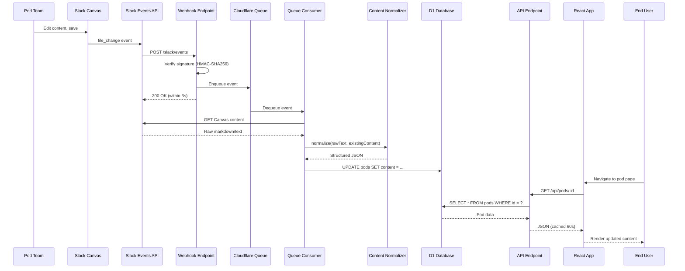

# ADR 0003: Slack Events API Driven Publishing Pipeline

**Date**: June 26, 2026  
**Status**: Proposed  
**Deciders**: Engineering Team, Product Manager

---

## Context

Pod teams need to publish content updates to the Portfolio Intelligence portal. Currently, updates require:
1. Edit config files in git
2. Commit and push changes
3. Wait for CI/CD to deploy (~5 minutes)

This process has friction:
- Requires git knowledge
- Slow feedback loop
- Requires developer involvement
- No real-time updates

### Problem

**How can we enable pod teams to publish content updates quickly and without developer involvement?**

### Requirements

1. **Low Friction**: Teams can publish where they already work (Slack)
2. **Real-Time**: Updates appear in portal within 60 seconds
3. **No Training**: Uses familiar tools (Slack Canvas)
4. **Reliable**: Events are not lost, retries on failure
5. **Normalized**: Consistent format regardless of how content is written

---

## Decision

**Adopt an event-driven publishing pipeline using Slack Events API:**

```
Slack Canvas Edit
    ↓
Slack Events API (file_change event)
    ↓
Webhook Endpoint (POST /slack/events)
    ↓
Cloudflare Queue (buffer events)
    ↓
Queue Consumer (Cloudflare Worker)
    ↓
Content Normalizer (parse markdown → JSON)
    ↓
D1 Database (upsert pods table)
    ↓
React Frontend (fetch via API)
```

### Key Components

1. **Slack Canvas** - Content authoring surface
2. **Slack Events API** - Generates webhook events on file changes
3. **Webhook Endpoint** - Receives and validates events
4. **Queue** - Buffers events, enables async processing
5. **Normalizer** - Transforms raw Canvas text into structured JSON
6. **Database** - Stores normalized content

---

## Alternatives Considered

### Option 1: Manual Git Updates (Current)

**Description**: Edit config files, commit, deploy

**Pros**:
- Version control built-in
- No external dependencies
- Simple architecture

**Cons**:
- Requires git knowledge
- Slow (5+ minute deploy)
- Developer involvement needed
- No real-time updates

**Verdict**: ❌ Current state - too much friction

### Option 2: Admin UI with Database

**Description**: Build web UI for editing content, store in database

**Pros**:
- User-friendly editing
- Real-time updates
- No git required
- Custom validation rules

**Cons**:
- High development effort (build entire CRUD UI)
- Yet another tool for teams to learn
- Requires authentication, permissions
- Maintenance burden

**Verdict**: ⚠️ Future enhancement, but not initial publishing solution

### Option 3: Google Docs with Polling

**Description**: Teams edit Google Docs, system polls for changes

**Pros**:
- Familiar editing experience
- Rich formatting

**Cons**:
- Polling is inefficient (waste resources)
- Google Drive API more complex than Slack
- Not integrated with team's workflow

**Verdict**: ❌ Rejected - polling is inefficient, not where teams work

### Option 4: Slack Canvas with Webhooks ✅

**Description**: Teams edit Slack Canvas, webhook fires on save

**Pros**:
- **Zero training** - Teams already use Slack
- **Real-time** - Webhook fires immediately on save
- **Event-driven** - Efficient, no polling
- **Collaborative** - Multiple editors
- **Audit trail** - Slack tracks who edited what
- **Low friction** - Edit where you already work

**Cons**:
- **Slack dependency** - Requires Slack Events API
- **Migration** - Need to create Canvas for each pod
- **Limited formatting** - Canvas is simpler than rich text editors

**Verdict**: ✅ **Selected** - Best balance of friction and features

---

## Architecture Details

### Event Flow



### Content Normalizer

**Purpose**: Transform raw Slack Canvas text into structured JSONB

**Input** (Raw Canvas):
```markdown
## Mission
Drive revenue growth through AI orchestration.

## Initiatives
Name | Status | Owner | Target Date
Pipeline optimization | On Track | Jane Smith | 2026-08-15
Deal acceleration | At Risk | John Doe | 2026-09-30

## Metrics
Value | Label | So What
23% | Pipeline Velocity | Deals moving faster
$2.4M | Additional ARR | Incremental revenue

## Next Steps
- Complete pilot rollout
- Integrate with CRM
```

**Output** (Normalized JSON):
```json
{
  "mission": "Drive revenue growth through AI orchestration.",
  "initiatives": [
    {
      "name": "Pipeline optimization",
      "status": "On Track",
      "owner": "Jane Smith",
      "targetDate": "2026-08-15"
    },
    {
      "name": "Deal acceleration",
      "status": "At Risk",
      "owner": "John Doe",
      "targetDate": "2026-09-30"
    }
  ],
  "metrics": [
    {
      "value": "23%",
      "label": "Pipeline Velocity",
      "soWhat": "Deals moving faster"
    },
    {
      "value": "$2.4M",
      "label": "Additional ARR",
      "soWhat": "Incremental revenue"
    }
  ],
  "nextSteps": [
    "Complete pilot rollout",
    "Integrate with CRM"
  ],
  "lastEditedAt": "2026-06-26T20:00:00Z"
}
```

**Key Features**:
- **Section-based parsing**: `## Header` defines sections
- **Table parsing**: Pipe-delimited rows become arrays of objects
- **List parsing**: Bullet/numbered lists become arrays
- **Partial updates**: Missing sections preserve existing values
- **Idempotent**: Same input always produces same output

### Canvas-to-Pod Mapping

Each pod is linked to a Slack Canvas via `canvas_id` field:

```sql
UPDATE pods SET canvas_id = 'F12345ABC' WHERE id = 'smb-revenue-orchestration';
```

When webhook receives `file_change` event with `file_id: F12345ABC`, it knows to update the `smb-revenue-orchestration` pod.

---

## Implementation Plan

### Phase 1: Infrastructure Setup

- [ ] Create Slack app
- [ ] Configure Event Subscriptions
- [ ] Add bot scopes: `files:read`, `channels:history`
- [ ] Deploy webhook endpoint
- [ ] Test URL verification challenge

### Phase 2: Canvas Creation

- [ ] Create Slack Canvas for pilot pod
- [ ] Document Canvas template format
- [ ] Train pod team on Canvas editing
- [ ] Map Canvas to pod in database

### Phase 3: Normalizer Development

- [ ] Implement normalizer function (pure, testable)
- [ ] Add unit tests for all parsing scenarios
- [ ] Handle edge cases (empty sections, malformed tables)

### Phase 4: End-to-End Integration

- [ ] Deploy webhook handler
- [ ] Connect to Cloudflare Queue
- [ ] Implement queue consumer
- [ ] Test: edit Canvas → update database
- [ ] Verify: frontend shows changes

### Phase 5: Pilot

- [ ] Pilot with one pod team
- [ ] Monitor webhook success rate
- [ ] Gather feedback
- [ ] Iterate on Canvas format if needed

### Phase 6: Rollout

- [ ] Expand to all pods
- [ ] Deprecate manual config updates
- [ ] Document process for new pods

---

## Consequences

### Positive

- **✅ Low Friction**: Teams edit in Slack (where they already are)
- **✅ Real-Time**: Updates appear within 60 seconds
- **✅ No Training**: Everyone already knows Slack
- **✅ Scalable**: Event-driven architecture scales automatically
- **✅ Reliable**: Queue + retries ensure no events are lost
- **✅ Audit Trail**: Slack tracks edit history

### Negative

- **❌ Slack Dependency**: Requires Slack Events API and bot token
- **❌ Limited Formatting**: Canvas is simpler than rich text editors
- **❌ Migration Effort**: Need to create and map Canvases
- **❌ Complexity**: Event-driven architecture is more complex than static files

### Neutral

- **⚖️ Content Format**: Markdown-based (simple but powerful enough)
- **⚖️ Async Processing**: Updates not instant (<60s acceptable)

---

## Risks and Mitigations

### Risk 1: Slack API Changes

**Risk**: Slack changes Canvas format or Events API

**Mitigation**:
- Monitor Slack changelog
- Normalizer is abstracted (can adapt to format changes)
- Slack has stable, versioned APIs

### Risk 2: Webhook Failures

**Risk**: Webhook goes down, events are lost

**Mitigation**:
- Queue buffers events (temporary outages OK)
- Retry logic with exponential backoff
- Dead letter queue for failed events
- Monitoring and alerts on error rate

### Risk 3: Content Normalization Errors

**Risk**: Normalizer can't parse Canvas, content is corrupted

**Mitigation**:
- Extensive unit tests for normalizer
- Preserve existing content on parse failure (don't wipe)
- Alert on normalization errors
- Manual review of failed events (DLQ)

### Risk 4: Adoption

**Risk**: Teams don't adopt Canvas, continue using git

**Mitigation**:
- Make Canvas editing easier than git
- Clear documentation and templates
- Training sessions with pod teams
- Show value (real-time updates, no deploy wait)

---

## Success Criteria

### Technical

- [ ] 99% of webhook events process successfully
- [ ] <10s latency (Canvas edit → database update)
- [ ] <1% normalization error rate
- [ ] Zero data loss (no events dropped)

### Product

- [ ] >80% of pods use Slack Canvas for updates
- [ ] <5 support requests per month
- [ ] Pod teams prefer Canvas over git
- [ ] Updates appear in portal within 60 seconds

### Business

- [ ] 50% reduction in "where is pod info?" Slack questions
- [ ] Product managers can update content without developer
- [ ] Pod information stays fresh (<1 week stale)

---

## Monitoring

### Metrics

- **Event Volume**: Events/hour received
- **Processing Latency**: Webhook receipt → database update
- **Error Rate**: % of events that fail
- **Queue Depth**: Number of pending events
- **Normalization Failures**: % of unparseable Canvases

### Alerts

- Error rate > 5%
- Queue depth > 100
- Processing latency > 30s
- Normalization failure rate > 2%

---

## Future Enhancements

- **Canvas Templates**: Pre-filled Canvas for new pods
- **Validation**: Real-time Canvas validation (check format before save)
- **Preview**: Preview pod page before publishing
- **Rollback**: Revert to previous Canvas version
- **Scheduled Publishing**: Publish at specific time
- **Multi-Canvas**: Support multiple Canvases per pod (sections)

---

## Related

- [Content Pipeline](../content-pipeline.md)
- [Architecture](../architecture.md)
- [Decisions Log](../decisions.md)
- [ADR 0001: Hosting](0001-hosting.md)
- [ADR 0002: Content Model](0002-content-model.md)

---

## Approval

**Status**: Proposed  
**Target Implementation**: Q4 2026  
**Approval Pending**: Engineering Lead, Product Manager

**Questions for Reviewers**:
1. Is Slack Canvas the right editing surface?
2. Are we comfortable with Slack dependency?
3. Is 60s latency acceptable?
4. Should we build admin UI as fallback?
