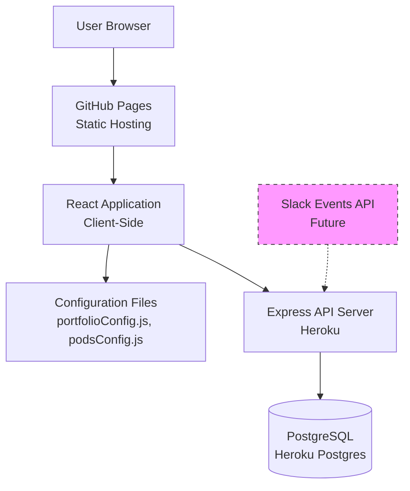
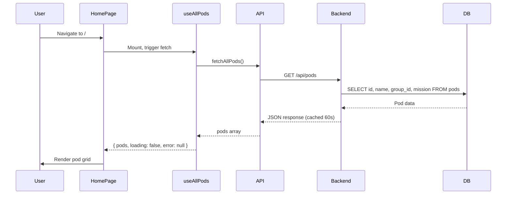
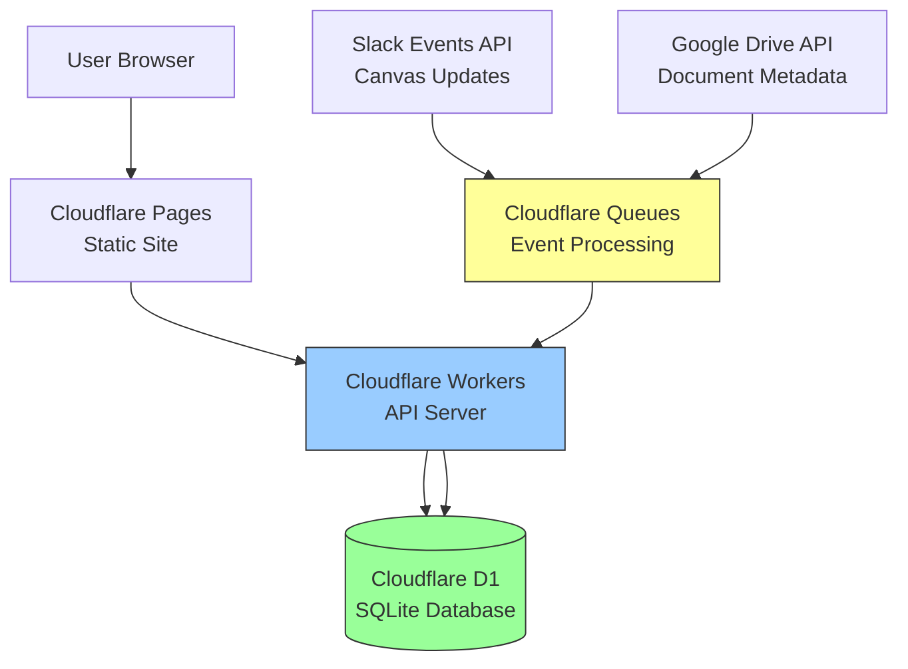
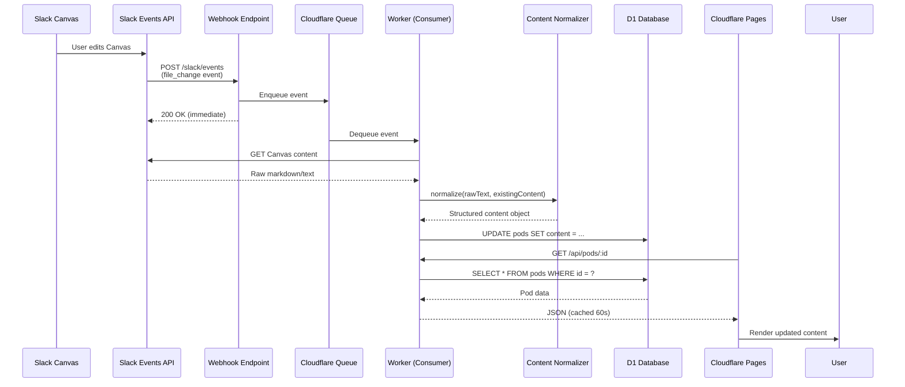

# Architecture Documentation

**Portfolio Intelligence System Architecture**

Last Updated: June 26, 2026

---

## Overview

Portfolio Intelligence is a **configuration-driven web application** designed to surface portfolio information to executives and stakeholders. The architecture prioritizes simplicity, maintainability, and future extensibility.

### Design Principles

1. **Configuration over Code** - Content lives in configuration files, not components
2. **Progressive Enhancement** - Start simple, add complexity as needed
3. **Clear Separation** - Presentation, data, and business logic are separated
4. **Future-Ready** - Design for multi-portfolio, automated content, and scale

---

## Current Architecture (v1.0)

### High-Level Overview



### Component Layers

```
┌─────────────────────────────────────────────────────────┐
│                   Presentation Layer                     │
│  React Components (pages/, components/)                  │
│  - Stateless, reusable                                  │
│  - Render data from props                                │
│  - No hardcoded content                                  │
└─────────────────────────────────────────────────────────┘
                          ↓
┌─────────────────────────────────────────────────────────┐
│                   Data Access Layer                      │
│  Custom Hooks (hooks/) + API Client (api/)               │
│  - useAllPods(), usePodData()                           │
│  - Handle loading, error states                          │
│  - Fetch from API or fallback to config                 │
└─────────────────────────────────────────────────────────┘
                          ↓
┌─────────────────────────────────────────────────────────┐
│                Configuration / API Layer                 │
│  Config Files (data/) + REST API (backend/)              │
│  - portfolioConfig.js (portfolio definitions)           │
│  - podsConfig.js (pod metadata)                         │
│  - Express routes (GET /api/pods)                       │
└─────────────────────────────────────────────────────────┘
                          ↓
┌─────────────────────────────────────────────────────────┐
│                    Data Persistence                      │
│  PostgreSQL Database                                     │
│  - pods table (id, group_id, name, content JSONB)       │
│  - Normalized content structure                          │
└─────────────────────────────────────────────────────────┘
```

---

## Frontend Architecture

### React Application Structure

```
frontend/src/
├── api/                    # API client layer
│   ├── config.js          # API endpoints, base URL
│   └── pods.js            # API functions (fetchAllPods, fetchPod)
│
├── components/             # Reusable UI components
│   ├── Badge.js           # Status badge
│   ├── Button.js          # Button variants
│   ├── Card.js            # Container component
│   ├── FeedbackForm.js    # User feedback widget
│   ├── Layout.js          # Page layout wrapper
│   └── ...
│
├── data/                   # Configuration files (static)
│   ├── portfolioConfig.js # Portfolio definitions
│   ├── podsConfig.js      # Pod metadata
│   └── podDetails.js      # Detailed pod content
│
├── hooks/                  # Custom React hooks
│   ├── useAllPods.js      # Fetch all pods with state management
│   └── usePodData.js      # Fetch single pod with state management
│
├── pages/                  # Page components (routes)
│   ├── HomePage.js        # Landing page with pod grid
│   ├── PodDetail.js       # Individual pod detail page
│   └── PodDetailWithAPI.js # API-powered pod detail
│
├── styles/                 # Global styles
│   └── design-tokens.css  # Design system tokens
│
├── App.js                  # Root component, routing
└── index.js                # Entry point
```

### Routing

```javascript
<Router>
  <Route path="/" element={<HomePage />} />
  <Route path="/pods/:podId" element={<PodDetail />} />
  <Route path="/executive" element={<StakeholderDashboard />} />
</Router>
```

Routes are defined in `App.js` using React Router v7.

### Component Hierarchy

```
App
├── Layout (header, footer)
│   ├── Header (navigation)
│   └── Footer
│
├── HomePage
│   ├── Hero Section
│   ├── Pod Grid
│   │   └── Card (repeats for each pod)
│   └── Business Metrics
│       └── MetricWithSource (repeats)
│
└── PodDetail
    ├── Hero Section
    ├── Mission Section (Card)
    ├── Initiatives Section
    │   └── Card (repeats for each initiative)
    ├── Metrics Section
    │   └── MetricCard (repeats)
    ├── Next Steps (Card)
    ├── Sources (Card)
    └── FeedbackForm
```

### Data Flow

**Homepage Example:**



### Configuration-Driven Design

**Problem**: Hardcoded content makes the app inflexible

**Solution**: Separate content from components

```javascript
// ❌ Bad: Hardcoded
function PodCard() {
  return <div>SMB Revenue Orchestration</div>;
}

// ✅ Good: Configuration-driven
function PodCard({ pod }) {
  return <div>{pod.name}</div>;
}

// Usage
const pods = portfolioConfig.pods; // From config file
pods.map(pod => <PodCard pod={pod} />);
```

All portfolio and pod content lives in:
- `frontend/src/data/portfolioConfig.js`
- `frontend/src/data/podsConfig.js`
- `frontend/src/data/podDetails.js`

Components are **pure renderers** that accept data via props.

---

## Backend Architecture

### Express API Server

```
backend/
├── db/
│   ├── client.js          # PostgreSQL connection pool
│   ├── schema.sql         # Database schema
│   └── seed.sql           # Initial data
│
├── routes/
│   ├── pods.js            # Pod API routes
│   └── feedback.js        # Feedback routes
│
├── slack/
│   ├── verifySignature.js # Slack webhook signature verification
│   └── eventHandler.js    # Process Slack events
│
├── normalizer/
│   └── index.js           # Content normalization logic
│
└── index.js               # Express server entry point
```

### API Routes

| Method | Endpoint | Purpose | Cache |
|--------|----------|---------|-------|
| GET | `/health` | Health check | No |
| GET | `/api/pods` | List all pods (lightweight) | 60s |
| GET | `/api/pods/:podId` | Get full pod content | 60s |
| POST | `/api/feedback` | Submit feedback | No |
| POST | `/slack/events` | Slack webhook | No |

### Database Schema

```sql
CREATE TABLE pods (
  id            TEXT PRIMARY KEY,           -- e.g. "smb-revenue-orchestration"
  group_id      TEXT NOT NULL,              -- e.g. "agentic-sales-productivity"
  name          TEXT NOT NULL,              -- Display name
  content       JSONB NOT NULL DEFAULT '{}',-- Structured content
  canvas_id     TEXT,                       -- Slack Canvas file ID
  last_synced_at TIMESTAMPTZ,              -- Last webhook update
  updated_at    TIMESTAMPTZ DEFAULT NOW()
);

CREATE INDEX pods_group_idx ON pods(group_id);
CREATE INDEX pods_canvas_idx ON pods(canvas_id);
```

### Content Model (JSONB)

```json
{
  "mission": "Pod mission statement",
  "initiatives": [
    {
      "name": "Initiative name",
      "status": "On Track | At Risk | Blocked | Complete",
      "owner": "Owner name",
      "targetDate": "YYYY-MM-DD"
    }
  ],
  "metrics": [
    {
      "value": "23%",
      "label": "Pipeline Velocity",
      "soWhat": "Business context"
    }
  ],
  "nextSteps": ["Step 1", "Step 2"],
  "sources": ["Source 1", "Source 2"],
  "lastEditedBy": "user@example.com",
  "lastEditedAt": "2026-06-26T20:00:00Z"
}
```

---

## Future Architecture (Target State)

### Cloudflare-Based Infrastructure



### Content Publishing Pipeline



### Multi-Portfolio Architecture

**Design Goal**: Support unlimited portfolios without code changes

```
Database:
  portfolios (id, name, slug, metadata)
       ↓
    pods (id, portfolio_id, name, content)
       ↓
  sections (id, pod_id, type, content)
```

**Frontend**: Dynamically render portfolios from API:

```javascript
// Fetch portfolios from API
const portfolios = await fetch('/api/portfolios');

// Render navigation
portfolios.map(portfolio => (
  <Link to={`/portfolio/${portfolio.slug}`}>
    {portfolio.name}
  </Link>
));
```

**No hardcoded portfolio names in components.**

---

## Key Design Decisions

### 1. Configuration-Driven Content

**Why**: Enables non-developers to update content without code changes

**How**:
- Content in JavaScript objects (`portfolioConfig.js`)
- Components accept data via props
- Adding a pod = editing config file

**Future**: Content moves from static files to database, still configuration-driven

### 2. Custom React Hooks for Data Fetching

**Why**: Centralize data fetching logic, handle loading/error states consistently

**How**:
- `useAllPods()` - Fetches all pods
- `usePodData(podId)` - Fetches single pod
- Hooks manage state internally

**Example**:
```javascript
const { pods, loading, error } = useAllPods();
if (loading) return <Spinner />;
if (error) return <Error message={error.message} />;
return <PodGrid pods={pods} />;
```

### 3. Normalized Content Model

**Why**: Consistent structure across all content sources (Slack, Drive, manual)

**How**:
- `normalizer/index.js` - Pure function transforms raw text → structured JSONB
- Handles partial updates (preserves existing fields)
- Maps Slack markdown → database schema

**Benefits**:
- Single content format regardless of source
- Easy to query and display
- Versioning-friendly

### 4. Cache-First API Strategy

**Why**: Reduce server load, improve performance

**How**:
- GET endpoints return `Cache-Control: public, max-age=60`
- Browser caches responses for 60 seconds
- Lightweight `/api/pods` endpoint (only id, name, mission)
- Full `/api/pods/:id` endpoint (complete content)

**Tradeoff**: Updates take up to 60s to appear (acceptable for executive dashboard)

### 5. Event-Driven Architecture (Future)

**Why**: Decouple content updates from API requests

**How**:
- Slack Canvas edit → webhook → queue → worker → database
- Async processing, immediate webhook response
- Retry logic, idempotent operations

**Benefits**:
- Real-time updates
- No polling
- Scalable

---

## Performance Considerations

### Frontend

- **Code splitting**: React lazy loading for routes (future)
- **Image optimization**: Compress assets, use modern formats
- **CSS**: Single stylesheet with design tokens (no CSS-in-JS overhead)
- **Bundle size**: Keep dependencies minimal

### Backend

- **Database queries**: Indexed fields (group_id, canvas_id)
- **Caching**: 60s cache on GET endpoints
- **Lightweight endpoints**: Separate list vs. detail endpoints
- **Connection pooling**: PostgreSQL pool for concurrent requests

### Cloudflare (Future)

- **Edge caching**: Cloudflare CDN
- **Workers**: Serverless, fast cold starts
- **D1**: SQLite at the edge
- **Zero egress fees**: Cheaper than traditional hosting

---

## Security

### Current

- **CORS**: Configured for GitHub Pages origin
- **Slack signature verification**: HMAC-SHA256
- **Environment variables**: Secrets in Heroku config, not committed
- **HTTPS**: GitHub Pages and Heroku provide SSL

### Future

- **Authentication**: OAuth for admin routes
- **Rate limiting**: Cloudflare Workers rate limiting
- **Input validation**: Validate all API inputs
- **Content Security Policy**: CSP headers on Cloudflare Pages

---

## Scalability

### Current Limits

- **Frontend**: GitHub Pages - unlimited static traffic
- **Backend**: Heroku Basic - 1 dyno, sleeps after 30min inactivity
- **Database**: Heroku Postgres Mini - 10k rows, 1GB storage

### Future Scale

- **Cloudflare**: Edge network, scales automatically
- **D1**: 100k reads/sec, 1k writes/sec per database
- **Workers**: Scales to millions of requests
- **Cost**: Pay-per-use, not per-dyno

---

## Monitoring (Proposed)

- **Frontend**: Error tracking (Sentry), analytics (Plausible)
- **Backend**: Logging (Cloudflare Logs), uptime monitoring
- **Database**: Query performance, slow query alerts
- **Slack webhook**: Event delivery rate, error rate

---

## Related Documentation

- [Content Pipeline](content-pipeline.md) - Automated publishing workflow
- [Decisions Log](decisions.md) - Engineering decisions and rationale
- [Deployment Guide](deployment.md) - Infrastructure and deployment
- [ADR 0001: Hosting](adr/0001-hosting.md) - Cloudflare decision
- [ADR 0002: Content Model](adr/0002-content-model.md) - Configuration-driven architecture
