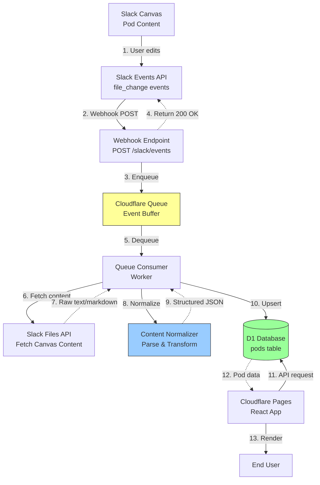
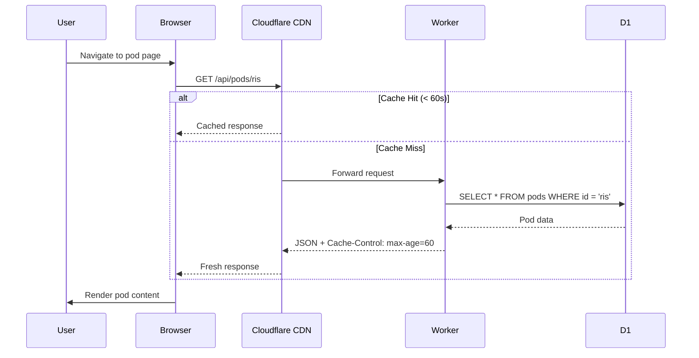
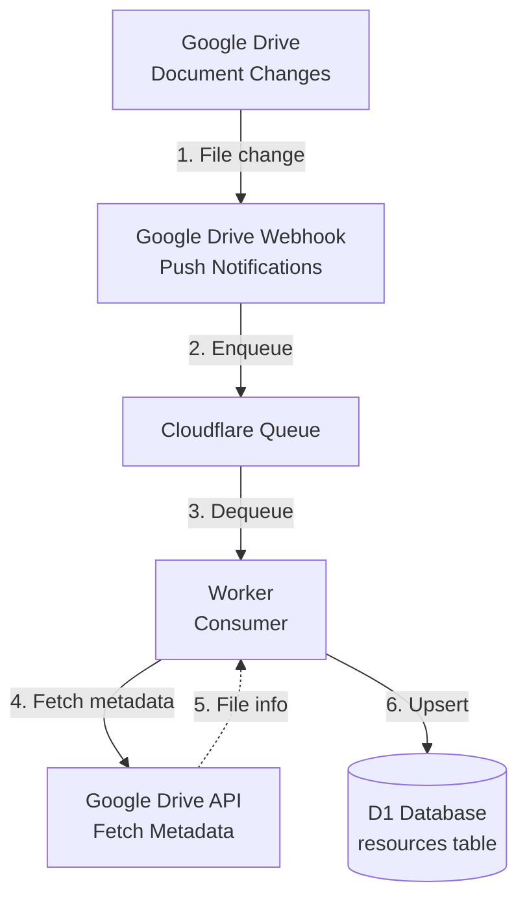

# Content Publishing Pipeline

**Automated Content Workflow from Slack Canvas to React Application**

Last Updated: June 26, 2026  
Status: **Proposed** (Implementation Phase)

---

## Overview

The Content Publishing Pipeline enables pod teams to **publish content updates directly from Slack Canvas**, which automatically flows through a normalized processing pipeline into the Portfolio Intelligence application.

### Design Goals

1. **Single Source of Truth** - Teams edit content in Slack Canvas once
2. **Automatic Publishing** - No manual steps to update the portal
3. **Real-Time Updates** - Changes appear in portal within 60 seconds
4. **Content Normalization** - Consistent format regardless of source
5. **Idempotent Processing** - Safe to replay events
6. **Error Recovery** - Retry logic and dead letter queues

---

## Architecture Overview



---

## Pipeline Stages

### Stage 1: Content Editing

**Actor**: Pod team member  
**Platform**: Slack Canvas  
**Action**: Edit pod content in designated Canvas

**Canvas Format**:
```markdown
## Mission
Drive revenue growth through AI orchestration.

## Initiatives
Name | Status | Owner | Target Date
Pipeline optimization | On Track | Jane Smith | 2026-08-15
Deal acceleration | At Risk | John Doe | 2026-09-30

## Metrics
Value | Label | So What
23% | Pipeline Velocity | Deals moving 23% faster
$2.4M | Additional ARR | Incremental revenue

## Next Steps
- Complete pilot rollout
- Integrate with CRM
- Gather feedback

## Sources
- FY26 Business Case Model
- Q2 Pilot Results
```

**Canvas Requirements**:
- Use standard Markdown headers (`## Section Name`)
- Use pipe-delimited tables for structured data
- Use bullet lists for arrays

### Stage 2: Event Generation

**Actor**: Slack Events API  
**Trigger**: Canvas file change  
**Event Type**: `file_change` with `filetype: "quip"`

**Event Payload**:
```json
{
  "type": "event_callback",
  "event": {
    "type": "file_change",
    "file_id": "F12345ABC",
    "file": {
      "id": "F12345ABC",
      "name": "SMB Revenue Orchestration Pod",
      "filetype": "quip",
      "user": "U98765XYZ"
    }
  },
  "event_id": "Ev12345",
  "event_time": 1719432000
}
```

### Stage 3: Webhook Receipt

**Endpoint**: `POST /slack/events`  
**Purpose**: Receive and validate Slack events

**Processing**:
1. **Signature Verification**
   - Verify `X-Slack-Signature` header using HMAC-SHA256
   - Check timestamp (reject if >5 minutes old)
   - Prevents unauthorized requests

2. **URL Verification** (first-time setup)
   ```json
   {
     "type": "url_verification",
     "challenge": "3eZbrw1aBm..."
   }
   ```
   Response: `{"challenge": "3eZbrw1aBm..."}`

3. **Event Enqueuing**
   - Push event to Cloudflare Queue
   - Return `200 OK` immediately (within 3 seconds)
   - Slack expects fast response

**Code Example**:
```javascript
app.post('/slack/events', verifySignature, async (req, res) => {
  const { type, event } = req.body;
  
  // Handle URL verification
  if (type === 'url_verification') {
    return res.json({ challenge: req.body.challenge });
  }
  
  // Enqueue event for processing
  await queue.send(event);
  
  // Return immediately
  res.status(200).json({ ok: true });
});
```

### Stage 4: Queue Processing

**Technology**: Cloudflare Queues  
**Purpose**: Buffer events, enable async processing

**Queue Configuration**:
```javascript
{
  name: "slack-events",
  max_batch_size: 10,
  max_batch_timeout: 30,  // seconds
  max_retries: 3,
  dead_letter_queue: "slack-events-dlq"
}
```

**Benefits**:
- **Decouples webhook from processing** - Fast webhook response
- **Handles spikes** - Buffers bursts of events
- **Retry logic** - Automatic retries on failure
- **Dead letter queue** - Failed events for investigation

### Stage 5: Event Consumption

**Actor**: Cloudflare Worker (Queue Consumer)  
**Trigger**: Queue delivers batch of events

**Processing Logic**:
```javascript
export default {
  async queue(batch, env) {
    for (const message of batch.messages) {
      try {
        await processEvent(message.body, env);
        message.ack();  // Success
      } catch (error) {
        message.retry();  // Retry up to max_retries
      }
    }
  }
};
```

### Stage 6: Canvas Content Fetch

**API**: Slack Files API  
**Endpoint**: `files.info` + `files.content`

**Request**:
```javascript
const response = await fetch('https://slack.com/api/files.info', {
  method: 'GET',
  headers: {
    'Authorization': `Bearer ${SLACK_BOT_TOKEN}`
  },
  params: {
    file: fileId
  }
});

const fileInfo = await response.json();
const contentUrl = fileInfo.file.url_private_download;

// Fetch actual content
const content = await fetch(contentUrl, {
  headers: {
    'Authorization': `Bearer ${SLACK_BOT_TOKEN}`
  }
});

const rawText = await content.text();
```

**Canvas Format**: Markdown or plain text

### Stage 7: Content Normalization

**Function**: `normalize(rawCanvasText, existingContent)`  
**Purpose**: Transform raw text into structured JSONB

**Input** (Raw Canvas Text):
```markdown
## Mission
Drive revenue growth...

## Initiatives
Pipeline optimization | On Track | Jane Smith | 2026-08-15
```

**Output** (Structured JSON):
```json
{
  "mission": "Drive revenue growth...",
  "initiatives": [
    {
      "name": "Pipeline optimization",
      "status": "On Track",
      "owner": "Jane Smith",
      "targetDate": "2026-08-15"
    }
  ],
  "lastEditedAt": "2026-06-26T20:00:00Z"
}
```

**Normalization Rules**:
1. Parse sections by `## Header`
2. Parse tables by pipe delimiters (`|`)
3. Parse lists by bullet markers (`-`, `*`, `1.`)
4. Normalize status values (`On Track`, `At Risk`, `Blocked`, `Complete`)
5. **Preserve existing fields** if not in Canvas (partial updates safe)

**Implementation**:
```javascript
function normalize(rawText, existingContent = {}) {
  const content = { ...existingContent };
  const sections = parseByHeaders(rawText);
  
  if (sections.mission) {
    content.mission = sections.mission;
  }
  
  if (sections.initiatives) {
    content.initiatives = parseTable(sections.initiatives);
  }
  
  if (sections.metrics) {
    content.metrics = parseTable(sections.metrics);
  }
  
  content.lastEditedAt = new Date().toISOString();
  return content;
}
```

### Stage 8: Database Upsert

**Operation**: UPDATE pod content in D1

**Query**:
```sql
UPDATE pods
SET
  content = ?,
  last_synced_at = CURRENT_TIMESTAMP,
  updated_at = CURRENT_TIMESTAMP
WHERE canvas_id = ?
```

**Upsert Logic**:
```javascript
async function updatePodContent(canvasId, normalizedContent, db) {
  // Find pod by canvas_id
  const pod = await db
    .prepare('SELECT id FROM pods WHERE canvas_id = ?')
    .bind(canvasId)
    .first();
  
  if (!pod) {
    throw new Error(`No pod found for canvas_id: ${canvasId}`);
  }
  
  // Update content
  await db
    .prepare('UPDATE pods SET content = ?, last_synced_at = CURRENT_TIMESTAMP WHERE id = ?')
    .bind(JSON.stringify(normalizedContent), pod.id)
    .run();
}
```

### Stage 9: Frontend Consumption

**API Request**: `GET /api/pods/:podId`  
**Cache**: 60 seconds (browser + CDN)

**Sequence**:


---

## Canvas to Pod Mapping

### Database Association

Each pod is linked to a Slack Canvas via `canvas_id`:

```sql
UPDATE pods
SET canvas_id = 'F12345ABC'
WHERE id = 'smb-revenue-orchestration';
```

**How to get Canvas ID**:
1. Open Canvas in Slack
2. Copy link: `https://company.slack.com/files/USER/F12345ABC/filename`
3. Extract file ID: `F12345ABC`

### Mapping Table

| Pod ID | Pod Name | Canvas ID | Canvas Link |
|--------|----------|-----------|-------------|
| `smb-revenue-orchestration` | SMB Revenue Orchestration | `F12345ABC` | [Canvas](slack://...) |
| `slack-agentforce-for-sales` | Slack & Agentforce | `F67890DEF` | [Canvas](slack://...) |
| ... | ... | ... | ... |

### Initial Setup

```bash
# Connect each pod to its Canvas
heroku pg:psql -a pod-intelligence-api

UPDATE pods SET canvas_id = 'F12345ABC' WHERE id = 'smb-revenue-orchestration';
UPDATE pods SET canvas_id = 'F67890DEF' WHERE id = 'slack-agentforce-for-sales';
-- Repeat for all pods
```

---

## Google Drive Integration (Future)

### Architecture



### Use Case

**Problem**: Pod teams store documents in Google Drive  
**Goal**: Automatically link Drive documents to pods in portal

**Solution**:
1. Watch specific Drive folders (one per pod)
2. Receive webhook on file create/update
3. Fetch document metadata (title, URL, last modified)
4. Store in `resources` table linked to pod
5. Display in pod's "Resources" section

**Resources Table**:
```sql
CREATE TABLE resources (
  id TEXT PRIMARY KEY,
  pod_id TEXT REFERENCES pods(id),
  type TEXT,  -- 'drive' | 'slack' | 'linear'
  title TEXT,
  url TEXT,
  last_modified TIMESTAMPTZ,
  metadata JSONB
);
```

---

## Error Handling

### Webhook Errors

**Signature Verification Failed**:
- Log error with request details
- Return `401 Unauthorized`
- Alert on repeated failures (possible attack)

**Enqueue Failed**:
- Retry 3 times with exponential backoff
- Return `500` if all retries fail
- Alert operations team

### Queue Processing Errors

**Canvas Fetch Failed**:
- Retry up to 3 times
- Move to dead letter queue if all retries fail
- Alert pod owner (Canvas may be deleted or permissions changed)

**Normalization Failed**:
- Log raw Canvas text for debugging
- Fall back to existing content (don't wipe)
- Alert with Canvas ID and error details

**Database Update Failed**:
- Retry with exponential backoff
- Move to DLQ after max retries
- Alert database team

### Dead Letter Queue

**Purpose**: Capture events that failed after all retries

**Monitoring**:
- Daily check of DLQ depth
- Alert if depth > 10
- Manual investigation and replay

**Replay Process**:
```bash
# View failed events
wrangler queues consumer <queue-name> --dead-letter

# Replay single event
wrangler queues send <queue-name> --body '...'
```

---

## Monitoring & Observability

### Metrics

- **Event Rate**: Events/minute received by webhook
- **Queue Depth**: Number of pending events
- **Processing Latency**: Time from webhook to database update
- **Error Rate**: Failed normalizations, database errors
- **Cache Hit Rate**: Percentage of cached API responses

### Logging

**Webhook Logs**:
```json
{
  "timestamp": "2026-06-26T20:00:00Z",
  "event_type": "file_change",
  "file_id": "F12345ABC",
  "pod_id": "smb-revenue-orchestration",
  "status": "enqueued"
}
```

**Processing Logs**:
```json
{
  "timestamp": "2026-06-26T20:00:05Z",
  "file_id": "F12345ABC",
  "pod_id": "smb-revenue-orchestration",
  "stage": "normalized",
  "duration_ms": 450
}
```

### Alerts

- **High Error Rate**: >5% of events failing
- **Queue Backlog**: >100 events pending
- **Slow Processing**: >10s latency
- **Dead Letter Queue**: >10 failed events

---

## Testing Strategy

### Unit Tests

- `normalizer/index.js` - Test all parsing scenarios
- Edge cases: empty sections, malformed tables, missing headers

### Integration Tests

- Webhook → Queue → Consumer → Database (end-to-end)
- Mock Slack API responses
- Verify database state after processing

### Manual Testing

1. **Edit Canvas** in Slack
2. **Check Heroku logs**: `heroku logs --tail`
3. **Verify database**: `SELECT * FROM pods WHERE id = '...'`
4. **Wait 60s** (cache expiry)
5. **Refresh frontend**, confirm changes visible

---

## Performance Targets

| Metric | Target | Measurement |
|--------|--------|-------------|
| Webhook Response Time | <500ms | Time to return 200 OK |
| End-to-End Latency | <10s | Canvas edit → Database update |
| Throughput | 100 events/sec | Concurrent Canvas edits |
| Cache Hit Rate | >90% | Frontend API requests |
| Error Rate | <1% | Failed normalizations |

---

## Security Considerations

### Slack Webhook Security

- **Signature Verification**: HMAC-SHA256 with signing secret
- **Timestamp Validation**: Reject requests >5 minutes old
- **Request Replay Protection**: Store processed event IDs (optional)

### API Security

- **Authentication**: Slack Bot Token for API calls
- **Authorization**: Bot must have `files:read` scope
- **Rate Limiting**: Respect Slack API rate limits

### Data Privacy

- **No PII in Logs**: Redact user emails, Slack IDs
- **Audit Trail**: Log who made changes (Slack user ID)
- **Access Control**: Only pod owners can edit their Canvas

---

## Migration Plan

### Phase 1: Manual Updates (Current)

- Pod content in static config files
- Manual edits via git commits

### Phase 2: Database-Backed

- Move content from files to PostgreSQL
- API serves from database
- Still manually updated via admin UI

### Phase 3: Slack Integration

- Connect Canvases to pods
- Enable webhook endpoint
- Test with pilot pod

### Phase 4: Full Automation

- All pods using Slack Canvas
- Deprecate manual updates
- Monitor and iterate

---

## Related Documentation

- [Architecture](architecture.md) - System overview
- [ADR 0003: Slack Pipeline](adr/0003-slack-pipeline.md) - Decision rationale
- [Deployment Guide](deployment.md) - Infrastructure setup
